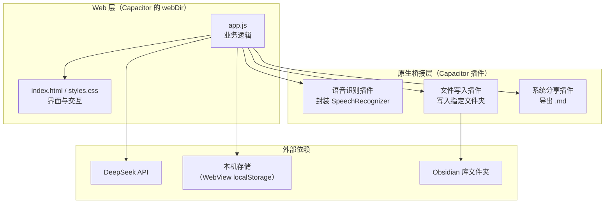
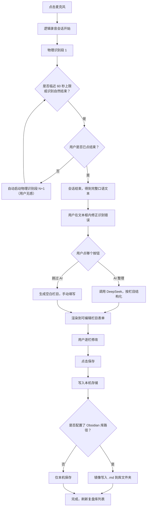
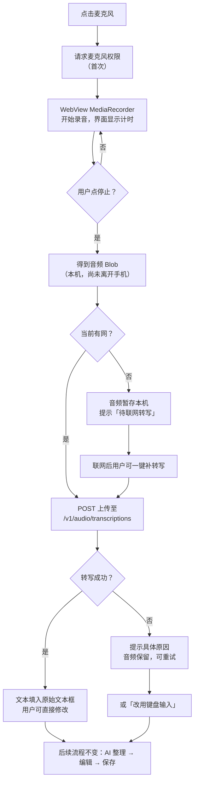

# 功能设计文档 — 每日工作复盘

> 配套文档：`product-requirements.md`（需求）· `architecture.md`（文件职责）· `progress.md`（开发进度）
> 记录规则：只增不删，变更在末尾追加版本小节。

## 文档信息

| 项 | 内容 |
| --- | --- |
| 版本 | 1.0 |
| 日期 | 2026-09-30 |
| 状态 | 待评审。**模板栏目部分等待用户提供后定稿** |

> 上表为 1.0 时的快照，按只增不删规则保留不改。**当前版本：1.3**，状态为**设计已定稿、待开工**。

> **1.1 更新（2026-09-30）**：用户已提供自定义模板栏目（见第十一节下方补记），该待定项解除。同时新增**第十三节**，记录一处经调研发现的、**影响第一节 1.1 与 5.2 可行性的语音识别风险**。1.0 原文按只增不删规则保留不改。

> **❗ 1.3 更新（2026-09-30）—— 语音链路主路线已切换，正文多处小节随之废弃**
>
> 用户就第十三节 13.8 的三个待决问题答复「都可以」：**① 接受实名认证；② 接受音频上传至服务商；③ 同意把主路线切换为云端 ASR**。
>
> 由此产生的影响：**第一节 1.1 / 1.2、第五节 5.1 / 5.2、第十节的里程碑划分**均不再代表当前设计。这些小节按只增不删规则**原文保留**，并已就近打上「1.3 起废弃」标记。
>
> **当前有效设计集中在新增的第十五节。阅读本文档时，以第十五节为准。**

---

## 一、设计前提：三个必须先满足的技术约束

这三条是调研得出的硬事实，整个设计围绕它们展开。

### 1.1 语音识别必须走原生桥接

安卓的 WebView **不支持** `webkitSpeechRecognition`（网页版语音识别 API）。因此：

- ❌ 不能只在网页里调 JS API
- ✅ 必须通过 Capacitor 写一个原生插件，调用安卓系统的 `SpeechRecognizer`

**为什么选系统识别而不是第三方 SDK**：零成本、零注册、语音数据不出本机。代价是中文准确率约 82~85%，且单次识别有时长上限。

> ⚠️ **1.3 起废弃** —— 语音识别已不再走原生桥接。新链路为「WebView 录音 → 上传云端 ASR」，见 **第十五节**。本节前半句（WebView 不支持网页语音识别 API）仍然成立，仍是必须用 Capacitor 外壳的理由之一；后半句的选型结论已作废。

### 1.2 单次识别约 60 秒上限 → 必须做「分段续录」

这是本设计最核心的机制。用户选择的是**单次口述 2~5 分钟**，远超上限。

如果不处理，用户说到 60 秒会被硬生生打断，语义断裂，体验灾难。

**方案**：应用层封装一个"逻辑录音会话"，内部由多个"物理识别段"串联而成。用户全程只感知到"一次录音"。

> ⚠️ **1.3 起废弃** —— 云端 ASR **没有 60 秒上限**，因此「分段续录」这一整套机制**整体取消**（见 **第十五节** 15.3）。
>
> 本节内容保留两个用途：① 作为历史设计的可追溯记录；② 万一将来需要「完全离线识别」，它是现成的降级方案参考。**当前设计不实现它。**

### 1.3 写入任意文件夹需用户授权

Android 11+ 的分区存储限制不允许应用随意写外部目录。

**方案**：首次配置 Obsidian 库路径时，弹出系统文件夹选择器（SAF），由用户手动选择目录并授权。**授权一次长期有效**，不需要每次确认。

---

## 二、技术架构总览



**分层原则**：业务逻辑（app.js）不直接碰原生能力，全部通过插件接口调用。这样即使某个原生能力不可用（如设备不支持语音识别），也能降级而不影响其他功能。

---

## 三、信息架构

```
应用
├── 记录（默认首页）
│   ├── 语音录制区
│   ├── 原始文本区（可编辑）
│   ├── 「AI 整理」按钮 / 「跳过 AI 手动填写」按钮
│   └── 整理结果区（按模板栏目，可编辑）→ 保存
│
├── 复盘库
│   ├── 统计栏（连续天数 / 总篇数 / 总字数）
│   ├── 搜索框
│   └── 列表（按月分组，倒序）→ 点击进入详情抽屉
│
└── 设置
    ├── DeepSeek：API Key / 模型选择 / 连通性测试
    ├── 模板管理：栏目增删改排序
    ├── Obsidian 库路径：选择文件夹 / 显示当前路径 / 测试写入
    ├── 导出与备份：单篇导出 / 全量导出
    └── 数据统计与清理
```

---

## 四、功能模块划分

| 模块 | 职责 | 输入 | 输出 | 依赖 |
| --- | --- | --- | --- | --- |
| **M1 语音识别** | 封装原生语音识别，提供"开始/停止/实时回调"接口 | 用户点击、麦克风音频 | 转写文本片段与最终文本 | 原生插件 |
| **M2 分段续录调度** | 管理逻辑录音会话，自动衔接多个物理识别段 | M1 的段结束事件 | 无断点的完整文本 | M1 |
| **M3 文本缓冲** | 维护用户可编辑的原始文本，实时渲染 | M2 的输出、用户键盘输入 | 原始口语文本 | M2 |
| **M4 AI 整理** | 调用 DeepSeek，把口语文本按模板结构化为各栏目内容 | 原始文本 + 模板定义 | 栏目 → 内容 的映射 | DeepSeek |
| **M5 模板管理** | 存储与编辑栏目定义（名称、顺序、启用状态） | 用户编辑 | 模板定义对象 | 本机存储 |
| **M6 复盘存储** | 复盘条目的增删改查，本机持久化 | 条目对象 | 条目列表 | 本机存储 |
| **M7 列表与检索** | 按月分组渲染、关键词搜索与高亮 | 条目列表、搜索词 | 渲染结果 | M6 |
| **M8 详情与编辑** | 单篇查看、编辑、删除、导出 | 条目 id | 更新后的条目 | M6 |
| **M9 数据看板** | 连续天数、篇数、字数、频率趋势的计算 | 条目列表 | 统计指标 | M6 |
| **M10 周月汇总** | 取一段时间内全部复盘，交 AI 汇总 | 时间范围 | 汇总文本 | M4、M6 |
| **M11 文件落盘** | 生成本机 `.md`；可选镜像写入 Obsidian 库 | 条目对象 | `.md` 文件 | 原生文件插件 |
| **M12 导出与分享** | 单篇 / 全量导出，调系统分享面板 | 条目或全部 | 分享动作 | 原生分享插件 |
| **M13 设置与凭据** | 管理 API Key、库路径等配置 | 用户输入 | 配置对象 | 本机存储 |

---

## 五、核心流程设计

### 5.1 主流程：从口述到落盘



### 5.2 分段续录机制（重点）⚠️ 1.3 起废弃

> **本小节自 1.3 起不再代表当前设计。** 云端 ASR 无单次时长上限，分段续录机制整体取消，新的录音—转写链路见 **第十五节**。以下内容作为历史设计保留，并在需要「完全离线识别」时作为降级方案参考。

**用户视角**：界面只显示一个「录音中 · 03:24」的计时器和波形，从头到尾没有中断感。

**实现视角**：内部是一串物理识别段的接力。

```
逻辑会话：  |=================== 用户感知到的一次录音 ===================|
物理识别段： |-- 段1 (≈55s) --|-- 段2 (≈55s) --|-- 段3 (用户喊停) --|
```

**触发续录的两种情况**：

1. **主动触发**：识别已持续接近安全阈值（建议 55 秒，留 5 秒余量）时，程序主动结束当前段并立刻启动下一段。
2. **被动触发**：识别返回超时类错误（说话停顿过久、无匹配结果）时，自动重启下一段，**不向用户报错**。

**文本拼接规则**：

- 段与段之间插入换行符（保留说话人的自然停顿感）
- 每段结果做首尾空白清理
- **不做智能语义合并** —— 避免拼接处出现语义猜测导致的错误
- 拼接后文本实时追加显示在文本框，用户随说随见

**用户结束会话**：只通过「停止」按钮。**不做静默自动结束** —— 说话中的自然停顿不代表说完了，自动结束会造成内容截断。

**异常处理**：

| 情况 | 处理 |
| --- | --- |
| 来电 / 音频焦点被抢 | 暂停会话，来电结束后提示「是否继续」 |
| 切换到后台 | 保持会话，返回时继续；超过 5 分钟未返回则结束并保存已有文本 |
| 蓝牙耳机断开 | 切换回手机麦克风，不中断会话 |
| 权限被拒绝 | 提示开启麦克风权限，并提供「改用键盘输入」入口 |
| 设备不支持语音识别 | 首次使用做能力检测，不支持则直接进入键盘模式并说明原因 |

### 5.3 AI 整理流程

**触发方式**：用户点击「AI 整理成复盘」按钮。不自动触发 —— 避免用户还没说完就消耗额度，也便于用户先自行修正识别错误。

**输入**：
- 完整原始口语文本
- 当前模板的栏目定义（栏目名列表）

**提示词设计四条原则**：

1. **只整理，不添加。** 明确要求：不得补充用户未提及的事实、判断、建议。
2. **口语转书面语。** 去掉"嗯""那个""然后然后"这类填充词，理顺语序，但保留原意与个人语气。
3. **按栏目归位。** 用户提到但无法归入任何栏目的内容，统一放入第一个栏目，**不得丢弃**。
4. **允许留空。** 某个栏目用户没提，写「（未提及）」，不得编造。

**输出格式**：结构化 JSON，key 为栏目标识，value 为该栏目正文（支持 Markdown 列表格式的多条内容）。

**结果校验**：
- 栏目数量与模板定义不一致 → 缺失的补「（未提及）」，多余的并入第一栏
- JSON 解析失败 → 重试一次；仍失败则把原始返回文本整体放入第一个栏目，并提示用户手动整理
- **绝不允许因为解析问题丢弃用户说的话**

**异常与降级**：

| 异常 | 界面提示 | 后续动作 |
| --- | --- | --- |
| 未配置 API Key | 「尚未配置 DeepSeek Key，是否现在去设置？」 | 提供「跳过 AI 手动填写」 |
| Key 无效（401） | 「Key 无效或已失效，请到设置页检查」 | 同上 |
| 余额不足 | 「账户余额不足」 | 同上 |
| 网络不可达 | 「网络连接失败，原文已保留」 | 同上 |
| 请求超时（>60 秒） | 「整理超时，可重试或手动填写」 | 提供重试按钮 |
| 返回内容为空 | 「AI 返回为空，请手动填写」 | 同上 |

**关键保证：任何失败路径都不丢失用户已输入的文本。**

### 5.4 保存与落盘流程

**数据源优先级**：本机存储是**唯一真相源**。Obsidian 库文件夹是**镜像**，只写不读。

这样设计的原因：避免"两个地方都有数据、不知道哪个是最新"的困扰。应用永远只相信自己本机的那份。

**保存步骤**：

1. 生成本机复盘条目（含各栏目内容、原始文本、时间戳）
2. 写入本机存储
3. 若已配置 Obsidian 库路径 → 生成 `.md` 并写入；写入失败**不影响本机保存成功**，只提示"镜像写入失败，可稍后在详情页重试"
4. 刷新复盘库列表

**同一天多次记录**：追加到同一个文件，在文件内用 `## 时段` 小标题分隔（如"上午" / "晚上"），**不新建文件**。理由：保持"一天一个文件"的直观对应关系，便于按日期浏览和同步。

### 5.5 浏览与检索流程

**列表**：
- 默认按日期倒序
- 按月分组，组标题形如「2026 年 9 月 · 12 篇」
- 每条显示：日期、星期、各栏目内容摘要（前两栏拼接，超出截断）、字数

**搜索**：
- 输入即过滤（无需点搜索按钮）
- 匹配范围：日期 + 全部栏目正文 + 原始口语文本
- 命中词在列表摘要中高亮
- 无结果时显示空态提示 + "清除搜索"按钮

### 5.6 数据看板

| 指标 | 定义 |
| --- | --- |
| 连续记录天数 | 从今天往回数，连续有复盘的天数。今天尚未记录时，从昨天起算（避免早上打开看到"连续 0 天"的打击感） |
| 累计篇数 | 复盘条目总数 |
| 累计字数 | 全部栏目正文字数之和（不含 frontmatter） |
| 频率趋势 | 最近 12 周的每周篇数，用迷你柱状图呈现 |
| 本月记录天数 | 当月已记录天数 / 当月已过天数 |

### 5.7 周 / 月汇总

**流程**：

1. 用户选择范围（本周 / 本月 / 自定义起止日期）
2. 系统取出范围内全部复盘，拼成一段带日期的文本
3. 调用 AI，提示词要求：提炼反复出现的问题、总结进展、指出值得注意的模式；**只基于给定内容，不添加外部信息**
4. 结果展示在独立页面，可编辑
5. 可选择保存为单独文件（如 `2026-09 月度汇总.md`）或仅查看

**边界**：范围内无复盘时直接提示，不调用 AI（不浪费额度）。

---

## 六、界面设计

### 6.1 记录页（默认首页）

| 元素 | 说明 |
| --- | --- |
| 顶部日期 | 显示当前日期与星期，可点击切换记录日期（补录用） |
| 麦克风按钮 | 页面视觉中心。三种状态：待命 / 录音中（脉冲动画）/ 处理中 |
| 录音计时 | 录音中显示 `03:24`，让用户知道已经说了多久（针对 2~5 分钟场景的必要信息） |
| 原始文本区 | 可编辑文本框。转写结果实时追加；用户可直接修改 |
| 主按钮 | 「AI 整理成复盘」 |
| 次按钮 | 「跳过 AI 手动填写」—— **必须有，作为所有 AI 异常路径的出口** |
| 整理结果区 | 按模板栏目渲染为独立可编辑块，每块有栏目名标题 |
| 保存按钮 | 保存后 Toast 提示，并清空当前记录准备下一次 |

**状态设计**：

| 状态 | 界面表现 |
| --- | --- |
| 空 | 麦克风居中，提示"点一下，说说今天的工作" |
| 录音中 | 脉冲动画 + 计时 + 实时文字；其他操作区置灰 |
| 转写完成待整理 | 显示全文，主按钮高亮 |
| AI 整理中 | 主按钮变为加载态 + 文字"正在整理…"，**不阻塞页面滚动与编辑** |
| 整理完成 | 展开栏目表单，保存按钮高亮 |
| 出错 | Toast 说明具体原因 + 指向可用的降级按钮 |

### 6.2 复盘库页

- 顶部统计栏：连续天数 / 总篇数 / 总字数（三格卡片）
- 搜索框：置顶吸顶，输入即过滤
- 列表：按月分组；每条为卡片式，显示日期、星期、摘要、字数
- 空态：「还没有复盘记录，去记录第一条吧」+ 跳转按钮

### 6.3 详情抽屉

- 从列表项点击后从底部滑出，展示全文
- 顶部：日期 + 编辑 / 导出 / 删除 三个操作
- 正文：按栏目分块渲染
- 编辑模式：各栏目变为可编辑文本框，底部出现保存按钮
- 删除：二次确认，说明"删除后不可恢复（Obsidian 库中的文件需手动删除）"

### 6.4 设置页

| 分组 | 内容 |
| --- | --- |
| DeepSeek | API Key 输入框（密文显示，可切换明文）、模型选择、**「测试连接」按钮** |
| 模板管理 | 栏目列表，支持增、删、改名、拖动排序 |
| Obsidian | 当前库路径（未配置时显示"未设置"）、「选择文件夹」按钮、「测试写入」按钮、开关"保存时同步写入" |
| 导出与备份 | 「导出全部为 .md」、说明备份建议 |
| 数据 | 条目数、占用空间、清空数据（二次确认） |
| 关于 | 版本号、GitHub 仓库地址 |

**「测试连接」和「测试写入」两个按钮是刻意设计的** —— 目标用户不会看日志，必须能自己验证配置是否生效。

---

## 七、数据设计

### 7.1 本机数据模型

复盘条目对象（存放于本机存储）：

| 字段 | 类型 | 说明 |
| --- | --- | --- |
| `id` | 字符串 | 唯一标识，建议用时间戳 |
| `date` | 字符串 | `YYYY-MM-DD` |
| `createdAt` / `updatedAt` | 时间戳 | 创建与最后修改时间 |
| `templateId` | 字符串 | 使用的模板版本标识 |
| `sections` | 数组 | `[{ id, title, content }]`，按模板栏目顺序 |
| `rawText` | 字符串 | 原始口语转写文本（保留，便于对照找回被 AI 整理掉的内容） |
| `aiModel` | 字符串 | 使用的模型名，未用 AI 时为空 |
| `wordCount` | 数字 | 各栏目正文字数合计 |

### 7.2 `.md` 文件格式

```markdown
---
date: 2026-09-30
weekday: 周三
created: 2026-09-30T22:14:05+08:00
updated: 2026-09-30T22:21:33+08:00
words: 486
ai: deepseek-chat
tags:
  - 工作复盘
---

# 2026-09-30 周三 · 工作复盘

## 今日完成

- 完成 A 模块的联调
- 梳理了 B 需求的技术方案

## 问题与卡点

- C 接口的返回字段和文档不一致，卡了半天

## 感悟收获

联调出问题时，先看文档不如先抓一次真实请求。

## 明日计划

- 和 D 确认 C 接口的字段定义

---

## 原始口述记录

> 以下为语音转写的原始文本，未做整理，仅供对照。

今天上午主要在弄 A 模块……
```

**设计说明**：
- frontmatter 用标准 YAML，Obsidian 可直接识别为属性
- `tags` 便于 Obsidian 内筛选
- 原始口述记录放在最后，用分隔线隔开，**便于在 Obsidian 中通过折叠或忽略保持正文整洁**
- 全部为标准 Markdown，无私有语法

### 7.3 命名与目录

**文件命名**：`YYYY-MM-DD.md`（如 `2026-09-30.md`）

理由：纯日期命名排序天然正确、跨平台安全、便于脚本处理。星期与"工作复盘"等描述性文字放在文件内的标题行，不放在文件名里。

**目录结构**（写入 Obsidian 库时）：

```
<Obsidian 库>/
└── 复盘/
    ├── 2026/
    │   ├── 09/
    │   │   ├── 2026-09-26.md
    │   │   ├── 2026-09-27.md
    │   │   └── 2026-09-30.md
    │   └── 10/
    └── 汇总/
        └── 2026-09 月度汇总.md
```

理由：按年 / 月分目录，文件多了也不会卡；汇总与日常复盘分开，避免混在一起。

---

## 八、异常与边界情况

| # | 情况 | 处理策略 |
| --- | --- | --- |
| 1 | 录音过程中切后台 / 来电 | 暂停会话，返回后询问是否继续 |
| 2 | 转写结果为空（用户没说话 / 识别失败） | 提示"没有识别到内容"，保留空文本框，可重说或键盘输入 |
| 3 | 未配置 API Key | 主按钮点击后引导去设置，同时高亮「跳过 AI」按钮 |
| 4 | 无网络 | 录音、转写、保存全部可用；仅 AI 整理不可用，明确提示 |
| 5 | 存储空间不足 | 保存前检查，提前警告而非失败后报错 |
| 6 | 同一天重复保存 | 追加到同一文件，用时段小标题分隔 |
| 7 | 跨天记录（23:59 开始，00:01 结束） | 以**开始录音的时间**归日 |
| 8 | Obsidian 文件夹写入失败 | 本机保存仍然成功，提示可重试，不阻塞主流程 |
| 9 | 用户清除了应用数据 | 引导从 Obsidian 库或备份恢复；设置页明确提示风险 |
| 10 | 模板被修改后，旧复盘如何显示 | 旧复盘保持其保存时的栏目结构，不随模板变化而改变 |
| 11 | 搜索结果过多 | 分页加载，先渲染最近 20 条 |
| 12 | 单篇复盘极长（超过 5000 字） | 详情页正常滚动；AI 汇总时对超长内容做截断并提示 |

---

## 九、外部接口

### 9.1 DeepSeek API

| 项 | 值 |
| --- | --- |
| 接口地址 | `https://api.deepseek.com/chat/completions` |
| 认证 | `Authorization: Bearer <API Key>` |
| 模型 | `deepseek-chat`（默认，可在设置中切换） |
| 请求格式 | 兼容 OpenAI Chat Completions 格式 |
| 输出约束 | 要求返回 JSON；对返回内容做解析与容错 |
| 超时 | 60 秒 |
| 重试 | 失败重试 1 次（仅针对网络类错误，不对 401 重试） |
| 费用 | 按 token 计费，单次复盘约几分钱 |

**安全要求**：API Key 仅存于本机存储，**不得出现在任何写入文件的内容中**，日志中需打码。

### 9.2 Obsidian 库文件夹

- 通过系统文件夹选择器（SAF）授权目标目录
- 应用只写入，不读取
- 写入前检查目录是否可写，并提供「测试写入」按钮

### 9.3 文件夹同步（应用外）

应用**不实现**同步功能，仅约定目录。用户自行选择同步工具：

| 工具 | 说明 |
| --- | --- |
| 坚果云 | 国内速度好，有免费额度 |
| Syncthing | 完全免费、点对点、无需账号，但需两端都装 |
| OneDrive / 百度网盘 | 取决于用户已有的服务 |

---

## 十、里程碑规划

| 阶段 | 内容 | 验收标准 |
| --- | --- | --- |
| **M0** | Capacitor 工程初始化，能跑起空壳 | 手机上能打开应用，三个标签可切换 |
| **M1** | 核心闭环：录音 → 分段续录 → 转写 → AI 整理 → 编辑 → 保存 | 能完整记录一条复盘并在列表看到 |
| **M2** | 复盘库完善：列表分组、搜索、详情编辑、导出 | 能搜到历史记录并修改保存 |
| **M3** | Obsidian 联动：文件夹授权、镜像写入 | 电脑端 Obsidian 自动出现当天文件 |
| **M4** | 数据看板 + 周月汇总 | 连续天数正确；能生成月度小结 |
| **M5** | 打包 APK 并在真机长期试用 | 连续 7 天正常使用不出故障 |

**M1 是分水岭** —— 跑通即意味着产品成立了，后面都是增强。

> ⚠️ **1.3 起修订** —— M1 的内容中「分段续录」已取消。修订后的阶段划分：
>
> | 阶段 | 内容（1.3 修订后） | 验收标准 |
> | --- | --- | --- |
> | **M0** | Capacitor 工程初始化，能跑起空壳 | 手机上能打开应用，三个标签可切换（**不变**） |
> | **M1** | 核心闭环：录音 → 上传转写 → AI 整理 → 编辑 → 保存 | 能完整记录一条复盘并在列表看到（**不变**） |
> | **M2** | 复盘库完善：列表分组、搜索、详情编辑、导出 | 能搜到历史记录并修改保存（**不变**） |
> | **M3** | Obsidian 联动：文件夹授权、镜像写入 | 电脑端 Obsidian 自动出现当天文件（**不变**） |
> | **M4** | 数据看板 + 周月汇总 | 连续天数正确；能生成月度小结（**不变**） |
> | **M5** | 打包 APK 并在真机长期试用 | 连续 7 天正常使用不出故障（**不变**） |
>
> 变化只有一处：**M1 里不再包含分段续录**。里程碑的分档数量与验收口径均无需调整，因为原设计里最复杂的那块被整块移除，而不是被替换成另一个复杂机制。

---

## 十一、待定事项

| # | 事项 | 阻塞对象 |
| --- | --- | --- |
| 1 | **用户的自定义模板栏目（名称、顺序、是否带填写提示）** | **阻塞 M5 模板管理模块与 AI 提示词的定稿** |
| 2 | 录音安全阈值秒数（建议 55 秒） | 需真机实测各家识别引擎后确定 |
| 3 | 是否保留原始口述文本 | 设计上默认保留（利于对照），待用户确认 |
| 4 | 数据看板的"连续天数"是否需要更宽松的定义（如允许断一天） | 待用户决定 |
| 5 | 是否需要"草稿自动保存"（录音中途崩溃可恢复） | 待评估 |

> **补记（1.1，2026-09-30）：待定事项 1 已解除。**
>
> 用户提供的自定义模板栏目如下，此为 **M4 提示词与 M5 模板层的初始值**：
>
> | 序号 | 栏目名 |
> | --- | --- |
> | 1 | 完成任务汇总 |
> | 2 | 卡点疑惑 |
> | 3 | 感受与收获 |
> | 4 | 明日待办 |
>
> 说明：
> - 栏目名**按用户原文记录**，其中第 4 项原记为「明日代办」；用户已于 2026-09-30 确认修正为 **「明日待办」**，上表为修正后的最终值。
> - 应用内模板**仍完全可编辑**（增删、改名、拖动排序），此处仅为出厂初始值。
> - 该四项即 5.3 提示词中「按栏目归位」的栏目定义；AI 未提及的栏目填「（未提及）」。

---

## 十三、补充：语音识别可用性风险（1.1 补记）

> 用户于 2026-09-30 提供手机型号：**OPPO Reno14（ColorOS 15 / Android 15，天玑 8350）**。据此查得以下事实，**直接影响第一节 1.1 与 5.2 的可行性**，必须在动工前实测确认。

### 13.1 问题：国内 OEM ROM 上 `isRecognitionAvailable()` 会返回 false

安卓标准语音识别 API 依赖系统注册的 `RecognitionService`。国内 OEM ROM（**小米 / 华为 / OPPO / vivo**）普遍**不预装 Google 语音服务**，导致：

```java
SpeechRecognizer.isRecognitionAvailable(context)   // 返回 false
```

**但 `false` 不等于"没有引擎"。** 2026 年 3 月一份开源项目的适配修复（openclaw#38691）指出：这些机型**自带可用的 OEM 语音引擎**（例：小米的 `com.xiaomi.mibrain.speech/.asr.AsrService`），只是**没有注册为默认服务**，因此标准检测查不到。

正确做法是**绕开该检测**，直接读取系统配置的引擎并定向调用：

```java
// 1) 读系统配置中的语音识别服务组件名
String svc = Settings.Secure.getString(getContentResolver(), "voice_recognition_service");
// 2) 定向创建识别器，而不是用默认的
SpeechRecognizer.createSpeechRecognizer(context, ComponentName.unflattenFromString(svc));
```

另有两条实现注意：

- `targetSdkVersion ≥ 31` 时，**必须在 AndroidManifest 中声明 `<queries>`**（如 `<intent><action android:name="android.speech.RecognitionService"/></intent>`），否则 PackageManager 查询不到该服务，会抛 `ClassNotFoundException` / `SecurityException`，被上层封装成 "not available"。
- 该修复的评审意见也提醒：若无条件跳过检测，遇到**真的没有引擎**的设备会陷入 `onError` → 重试的**死循环**。因此仍需保留一次能力探测，只是探测方式要从「信默认服务」改为「查系统配置的组件」。

### 13.2 OPPO 的额外不确定性

- 有较早年份的资料称 OPPO 自 Android 7.0 起 `isRecognitionAvailable()` 即返回 `false`，且当时无解
- 但 ColorOS 自带「录音转文字」「AI 语音摘要（AI VoiceScribe）」等能力，说明**本机确实存在 ASR 引擎**
- **该引擎是否以标准 `RecognitionService` 形式开放给第三方应用，无法从公开资料确定**
- 结论：**必须真机实测，不能靠推断**

### 13.3 实测方式：先用 adb，不先打 APK

原计划是先写一个语音探针 APK 来试。后来发现**用 adb 直接查更快、成本近乎为零**（Android SDK 的 `platform-tools` 已就位，`adb` 可用）：

```bash
# 1) 系统是否配置了语音识别服务？返回组件名即有
adb shell settings get secure voice_recognition_service

# 2) 机器上装了哪些可能提供识别能力的包
adb shell pm list packages | grep -iE "speech|voice|asr|iflytek|oppo"

# 3) 设备与系统信息（确认机型与版本）
adb shell getprop ro.product.model
adb shell getprop ro.build.version.release
```

判定：

| 现象 | 结论 | 下一步 |
| --- | --- | --- |
| 返回有效组件名 | 系统识别**大概率可走通** | 按 13.1 方式实现原生插件，原设计不变 |
| 返回 `null` 且无相关包 | 系统识别**不可用** | 转 13.4 的云端 ASR 方案 |

只有 adb 判断不了「引擎能否真的出字」时，才需要打那个最小探针 APK 兜底。

### 13.4 备选方案：云端 ASR（已核实可免费）

若系统识别不可用，改为「**本机录音 + 上传云端 ASR**」。这不只是绕过 ROM 问题，收益比预期大：

| 维度 | 系统识别 | 云端 ASR（如 SenseVoiceSmall） |
| --- | --- | --- |
| 费用 | 免费 | **免费**（硅基流动价格页标注该模型 0 元） |
| 单次时长上限 | **约 60 秒** → 必须做分段续录 | **无限制** → **分段续录整套机制可直接删除** |
| 中文准确率 | 约 82~85% | 明显更高 |
| 联网要求 | 不需要 | 需要（可先离线录音，联网后补转写） |
| 隐私 | 语音不出本机 | 音频上传至服务商 |
| 前置条件 | 无 | 需注册账号并**完成实名认证** |

**关键收益**：分段续录（5.2）原本是本设计**最核心也最危险**的机制——它是全项目唯一"可能根本做不成"的点。改走云端识别，**这套复杂度直接消失**。

**代价**：需注册 + 实名认证；音频不再只留在本机。需由用户拍板是否接受。

**处理方式**：**不提前改动 5.2 的设计**。等 13.3 的 adb 实测结果出来，再决定是否启用 13.4，届时同步修订 5.2、5.3 与第十节的里程碑。

### 13.5 云端方案的实现难度（1.2 补记）

> 用户于 2026-09-30 追问「云端方案技术难度怎么样」。评估结论如下。

**结论：技术难度低于系统识别方案。** 原因是原本最难的一块——**原生插件 + 分段续录**——会整体消失。

逐环节对比：

| 环节 | 系统识别（原方案） | 云端 ASR |
| --- | --- | --- |
| 录音 | 需写原生 Java 插件并桥接到 Web 层 | WebView 自带 `MediaRecorder`（**WebView Android 47+ 起完整支持**），**纯 JS** |
| 转文字 | 原生插件回调 + 绕开 `isRecognitionAvailable()` 陷阱 | **一次 HTTP POST**，与已确定的 DeepSeek 调用**同构** |
| 分段续录 | **必须自建**（60 秒上限逼出的状态机，本设计最复杂机制） | **整块删除** |
| 原生代码量 | 约 300~500 行 Java + Capacitor 桥接 | **0 行** |
| 新增 Web 代码量 | — | 约 80~120 行（录音 + 上传 + 重试） |
| 时长限制 | 约 60 秒 | 无（见 13.6 未知数 2） |

**调用方式**（与 DeepSeek 几乎一致，仅端点与参数不同）：

```
POST https://api.siliconflow.cn/v1/audio/transcriptions
Authorization: Bearer <API Key>
Content-Type: multipart/form-data

file  = <录音文件>            // 需实测格式，见 13.6
model = FunAudioLLM/SenseVoiceSmall
```

**已核实的免费事实**：硅基流动官方价格页将 `FunAudioLLM/SenseVoiceSmall` 标注为 **¥0**（输入输出均免费；同页 `Qwen/Qwen3-ASR-1.7B`、`TeleAI/TeleSpeechASR` 亦免费）。该模型的免费与收费版本以 **`Pro/` 前缀**区分，本方案用免费版即可。

> 注意：**自 2026-05-15 起，未完成实名认证的账户无法使用平台功能**，实名是使用免费模型的前置条件。

### 13.6 两个待实测的未知数

**未知数 1：录音格式兼容性（唯一可能卡住的地方）**

- WebView 的 `MediaRecorder` 在安卓上**通常输出 `audio/webm;codecs=opus`**
- 而服务商常规支持的格式为 mp3 / wav / ogg / m4a / flac，**webm 不在其列**
- 三条出路，按省事程度排序：

| 优先级 | 做法 | 代价 |
| --- | --- | --- |
| 1 | **直接上传 webm 试** —— 多数 ASR 服务端底层用 ffmpeg 解码，可自动识别容器 | 零成本，先试 |
| 2 | **让 WebView 录 `audio/mp4`（AAC）** —— 输出即 m4a，天然符合格式要求 | 新版 WebView 支持，纯 JS |
| 3 | 改用**原生 `MediaRecorder` 录 ogg/opus**（Android 10+ 支持 `OGG` 输出格式） | 需写一个极简插件，但仍远简单于语音识别插件 |

**未知数 2：单文件时长与大小上限**

- 官方接口文档未抓取到明确数字（文档站相关路径已 404），第三方说法互相矛盾（有称 10MB / 5 分钟，有称 100MB）
- 但无论取哪个值，**都远大于系统识别的 60 秒**
- 容量估算：opus 编码约 64 kbps → **5 分钟约 2.4MB，10 分钟约 4.8MB**，即使按最保守的 10MB 限制，10 分钟以内的口述也不触顶
- 实测一次即可确定

### 13.7 验证成本：几乎为零

这两个未知数**都不需要写完整应用**即可验证：

| 步骤 | 环境 | 做法 | 成本 |
| --- | --- | --- | --- |
| **A** | 电脑 | 注册硅基流动 → 实名认证 → 取 Key → 用一段测试音频**直接打接口**，确认连通性、webm 是否被接受、返回结构 | 约 10 分钟，无需写应用 |
| **B** | 手机 | 一个极小测试页，确认 WebView 实际录出的音频格式 | 极小 |

**步骤 A 完全在电脑上完成、不依赖手机**，因此它是新的关键路径。

### 13.8 路线选择（待用户拍板）

两条路线的性质对比：

| 维度 | 系统识别 | 云端 ASR |
| --- | --- | --- |
| 可行性 | **不确定**——取决于 OPPO 是否开放引擎（13.1、13.2） | **确定可行**（已有成熟服务） |
| 技术难度 | 高（原生插件 + 分段续录） | 低（纯 Web 代码） |
| 准确率 | 约 82~85% | 更高（SenseVoice 中文/粤语优于 Whisper） |
| 费用 | 免费 | 免费 |
| 时长 | 60 秒 | 基本无限制 |
| 联网 | 不需要 | **必须** |
| 隐私 | 语音不出本机 | **音频上传至服务商** |
| 前置 | 无 | **实名认证** |

**待决问题（需用户回答）**：

1. 是否接受**实名认证**硅基流动账号？
2. 是否接受**音频上传到服务商**（而非只留在本机）？
3. 是否切换主路线为云端 ASR？（建议切换，理由见 13.5：技术难度更低、效果更好、且免费；系统识别可保留为后续 P2 的离线降级选项）

**若用户接受，则修订范围**：5.2 分段续录（可删）、5.3 提示词、第十节里程碑、以及 `development-plan.md` 的 v0.0 探针定义（改为「录音 + 上传转写」探针）。adb 探测（13.3）随之从关键路径降为可选动作。

> **✅ 已决（1.3，2026-09-30）**
>
> 用户答复「**语音路线这几个问题都可以**」，即：
>
> | # | 待决问题 | 用户答复 |
> | --- | --- | --- |
> | 1 | 是否接受实名认证硅基流动账号 | ✅ 接受 |
> | 2 | 是否接受音频上传至服务商 | ✅ 接受 |
> | 3 | 是否切换主路线为云端 ASR | ✅ 切换 |
>
> 本小节所列修订范围**已全部执行**：新增 **第十五节**作为当前有效设计；第一节 1.1 / 1.2、第五节 5.2、第十节里程碑均已打上废弃或修订标记（原文保留）。
>
> 与此同时：**adb 探测（13.3）从关键路径降为可选动作**，新的关键路径是 13.7 的「步骤 A —— 在电脑上直接打接口」。

---

## 十五、语音链路修订：改用云端 ASR（1.3 起生效）

> **本节是当前有效设计。** 与本文档前面若干小节冲突时，以本节为准。前文冲突处已就近打上废弃标记，原文按只增不删规则保留。

### 15.1 决策与理由

| 项 | 结论 |
| --- | --- |
| 决策 | 语音转写由「安卓系统 `SpeechRecognizer` + 分段续录」**切换为**「WebView 本机录音 → 上传云端 ASR 转写」 |
| 决策日期 | 2026-09-30 |
| 决策人 | 用户（就 13.8 的三个待决问题答复「都可以」） |
| 服务商 | 硅基流动 SiliconFlow，模型 `FunAudioLLM/SenseVoiceSmall`（官方价格页标注 **¥0**） |
| 前置 | 账号需完成**实名认证**（2026-05-15 起未实名不可用平台功能） |

**切换理由（按重要性排序）**

1. **确定可行** —— 系统识别方案在 OPPO ColorOS 上是否开放标准 `RecognitionService` 无法从公开资料确定（13.2），是**全项目唯一"可能根本做不成"的点**；云端 ASR 是成熟服务，不存在可行性悬念。
2. **整块复杂度消失** —— 60 秒上限逼出的「分段续录」原本是本文档最核心也最危险的机制，云端 ASR 无此上限，该机制**整体删除**。
3. **原生代码大幅减少** —— 语音链路的 Java 代码从约 300~500 行降为 **0 行**（13.5）。
4. 中文识别准确率高于系统识别（尤其专有名词与行业术语），直接缓解风险 1（PRD 第六节）。
5. 费用同为**免费**。

**已知代价**

| 代价 | 说明 | 应对 |
| --- | --- | --- |
| 音频离开本机 | 录音需上传至服务商 | 用户已明确接受；应用内需明示（见 15.5） |
| 必须联网 | 转写依赖网络 | 采用「**先录后传**」：录音本身完全离线，未联网时音频留在本机，联网后可补转写（见 15.5） |
| 多一个外部依赖 | 硅基流动的可用性与政策变化 | 转写失败**绝不影响录音与保存**，可手动填写（既有降级路径不变） |
| 多一个 Key | 需在设置页维护硅基流动 Key | 与 DeepSeek Key 并列，同样只存本机，同样提供「测试」按钮 |

### 15.2 修订后的语音链路



**与旧链路的关键差异**

| 环节 | 旧（系统识别） | 新（云端 ASR） |
| --- | --- | --- |
| 录音 | 原生插件驱动 `SpeechRecognizer` | WebView 自带 `MediaRecorder`，**纯 JS** |
| 转写 | 原生插件实时回调文本 | **一次 HTTP POST**，与 DeepSeek 调用同构 |
| 实时性 | 边说边出字 | **说完再出字**（一句话的等待，通常数秒） |
| 时长上限 | 约 60 秒 | 无硬上限（见 15.4 未知数 2） |
| 分段续录 | 必须自建 | **取消** |
| 离线 | 完全可用 | 录音可用，转写需联网（可延后补） |

> **体验上的取舍要认下来**：从"边说边出字"变成"说完等几秒出整段"。换来的是准确率更高、不再担心断档丢字、界面逻辑更简单。这是本次切换最主要的**体验代价**。

### 15.3 取消的设计（不再实现）

| 原设计 | 位置 | 处置 |
| --- | --- | --- |
| 原理 1.2：单次识别 60 秒上限 → 必须分段续录 | 第一节 1.2 | **取消**。这是本次切换的起因 |
| 5.2 分段续录机制（含主动/被动续录、文本拼接规则、会话状态机） | 第五节 5.2 | **整块取消**。原文保留作历史记录与离线降级参考 |
| 模块 M2 分段续录调度 | 第四节 | **取消**。模块表相应简化为 M1 一项 |
| 原生语音识别插件 | 第二节架构图 | **取消** |
| Manifest `<queries>` 声明（`RecognitionService`） | 第十三节 13.1 | **取消**。不再查询系统识别服务 |
| 录音安全阈值 55 秒 | `development-plan.md` 8.12 第 2 条 | **取消** |
| adb 探测 `voice_recognition_service` | 第十三节 13.3 | **降为可选**。不再是关键路径，仅在需要验证「离线降级方案」时使用 |

**仍然保留的相关设计**

- 模块 M3 文本缓冲（用户可编辑的原始文本）—— 不变，且更重要了：转写是"一次性给一段"，用户修正的意愿会更强。
- 「跳过 AI 手动填写」按钮与全部 AI 异常降级路径 —— 不变。
- `rawText` 字段（保留原始口述文本）—— 不变。
- 录音计时器 —— 不变（虽无上限，用户仍需要知道说了多久）。

### 15.4 新增的设计

**① 模块调整**（第四节模块表的增量）

| 模块 | 变化 | 职责 |
| --- | --- | --- |
| M1 语音识别 | **改写为「M1 录音与转写」** | ① `MediaRecorder` 录音、② 音频暂存、③ 上传转写、④ 失败重试 |
| ~~M2 分段续录调度~~ | **取消** | — |

**② 设置页新增一组**（第六节 6.4 的增量）

| 分组 | 内容 |
| --- | --- |
| 语音转写 | 硅基流动 API Key（密文显示）、模型选择（默认 `FunAudioLLM/SenseVoiceSmall`）、**「测试转写」按钮** |

> 「测试转写」按钮的作用与「测试连接」「测试写入」一致：录一句 3 秒的话，直接显示转写结果。目标用户不看日志，必须能自己验证配置是否生效。

**③ 权限**

| 权限 | 用途 | 说明 |
| --- | --- | --- |
| `RECORD_AUDIO` | 录音 | 运行时权限，首次点麦克风时申请 |
| `INTERNET` | 上传转写 + 调用 DeepSeek | Capacitor 默认已声明 |

> 原生语音识别相关的权限与 `<queries>` 声明**不再需要**。

**④ 新增的默认决定（待用户确认，有异议请纠正）**

| # | 默认决定 | 说明 |
| --- | --- | --- |
| 1 | 音频**用完即删**，不在本机长期留存 | 转写成功后立即删除音频文件，仅保留文本。避免手机里堆积大量音频 |
| 2 | 未成功转写的音频**保留**，可手动重试 | 与"任何失败路径不丢数据"的底线一致 |
| 3 | 单次录音设**软上限 10 分钟** | 无硬性上限，但防止误触导致长时间录音占用空间；到时提示「是否继续」 |
| 4 | 音频格式优先级：先试 `audio/webm;codecs=opus` → 不行改录 `audio/mp4`（AAC） → 再不行退回原生 `MediaRecorder` 录 `ogg/opus` | 见 13.6 未知数 1，按省事程度排序，实测后定 |
| 5 | 上传失败的重试：网络类错误重试 1 次，与 DeepSeek 调用层策略一致 | — |

### 15.5 隐私与联网的明确交代

切换后必须让用户**清楚知道**两件事，并在界面上有所体现：

1. **录音会上传到服务商。** 建议在设置页「语音转写」分组下方写明一句白话，并在首次上传前弹一次说明。**不做静默上传。**
2. **断网时录音照常可用。** 录音、暂存、手写、保存全部离线可用；只有「转写」这一步需要联网，且可延后补做。

这两条同时也是对 `product-requirements.md` 非功能性需求的影响点 —— 「录音必须离线可用」**仍然成立**（录音环节离线），但「语音数据不出本机」这条**不再成立**，需在 PRD 中显式修订。

### 15.6 验证顺序（新的关键路径）

| 步骤 | 环境 | 做什么 | 解决什么 | 阻塞谁 |
| --- | --- | --- | --- | --- |
| **A**（关键路径） | **电脑** | 注册硅基流动 → 实名认证 → 取 Key → 用一段测试音频直接 `curl` 打接口 | 接口连通性、webm 是否被接受、返回结构、错误码 | 阶段一 `v0.0` |
| **B** | 手机 | 一个极小测试页，确认 WebView 实际录出的音频 MIME 类型 | 录音格式（13.6 未知数 1） | 阶段一 `v0.0` |
| **C** | 手机 | 用一段 5 分钟和一段 10 分钟的真实口述测 | 单文件时长/大小上限（13.6 未知数 2） | 阶段二 `v0.1` |

**步骤 A 不需要手机、不需要写应用**，是最该先做的一步。

> **备注**：原 13.3 的 adb 探测（`adb shell settings get secure voice_recognition_service`）**不再需要**。若将来要做「完全离线识别」降级方案，再拿出来用。

### 15.7 决策留痕：这条路什么时候该重新评估

切到云端 ASR 后，**触发重新评估的条件**只剩两条：

| 触发条件 | 应对 |
| --- | --- |
| 硅基流动取消该模型的免费额度，或实名政策变化 | 换服务商（同为免费/低价的同类模型），或启用保留在本文件 5.2 的离线降级方案 |
| 实测发现上传延迟严重影响体验（例如 5 分钟音频要等 1 分钟以上） | 评估边录边切块上传（增量转写），或重新考虑系统识别 |

**不做的事**：不预先为这两条写代码。等真出现再说 —— 这正是方案二「渐进交付」的意思。

---

## 十四、版本记录（1.1 起续）

| 版本 | 日期 | 变化 |
| --- | --- | --- |
| 1.1 | 2026-09-30 | 用户提供手机型号（OPPO Reno14 / ColorOS 15）与自定义模板栏目。补记第十一节待定事项 1 的解除与模板定义；新增第十三节「语音识别可用性风险」——含国内 OEM ROM 的 `isRecognitionAvailable()` 陷阱、正确适配方式、adb 实测步骤，以及云端 ASR 备选方案与收益对比。**1.0 原文未改动** |
| 1.2 | 2026-09-30 | ① 模板栏目第 4 项「明日代办」经用户确认修正为 **「明日待办」**（第十一节补记表）。② 第十三节新增 13.5~13.8：**云端 ASR 方案的实现难度评估**（逐环节对比、接口调用方式、免费事实与实名前置）、两个待实测未知数（录音格式兼容性 / 单文件时长上限）、验证成本评估（可全程在电脑上完成）、路线选择对比与三个待决问题。**1.0 / 1.1 原文未改动** |
| **1.3** | 2026-09-30 | **语音链路主路线切换为云端 ASR**（用户就 13.8 三问答复「都可以」）。**新增第十五节**为当前有效设计：决策与理由、修订后的链路图、取消清单（分段续录 / 原生语音插件 / `<queries>` / 55 秒阈值）、新增设计（M1 改写、设置页「语音转写」分组、权限、5 条默认决定）、隐私与断网降级交代、新的验证顺序（关键路径变为**电脑上直接打接口**）、重新评估的触发条件。**并在 1.1 / 1.2 / 5.2 / 第十节 / 13.8 就近打上废弃或修订标记，原文一律保留未删。** |

---

## 十二、版本记录

| 版本 | 日期 | 变化 |
| --- | --- | --- |
| 1.0 | 2026-09-30 | 首次成文。基于需求文档 1.0 与三项技术调研结论（WebView 不支持语音识别 / 系统识别 60 秒上限 / 分区存储需授权）编制 |

> 1.1 起的版本记录续见 **第十四节**。
