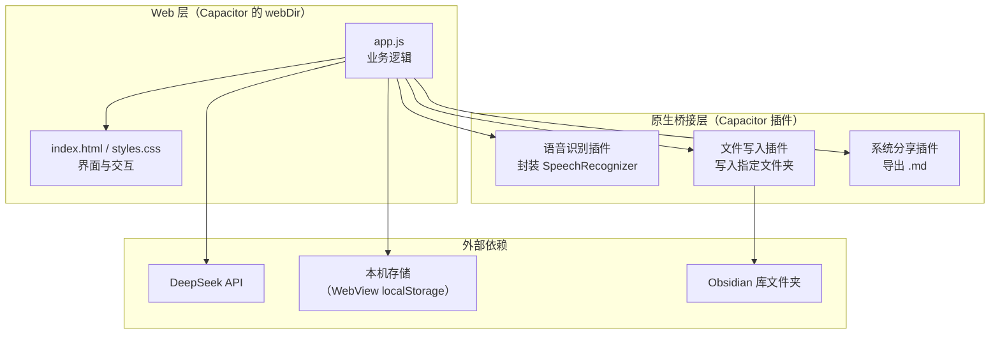
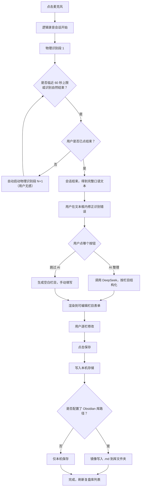

# 功能设计文档 — 每日工作复盘

> 配套文档：`product-requirements.md`（需求）· `architecture.md`（文件职责）· `progress.md`（开发进度）
> 记录规则：只增不删，变更在末尾追加版本小节。

## 文档信息

| 项 | 内容 |
| --- | --- |
| 版本 | 1.0 |
| 日期 | 2026-09-30 |
| 状态 | 待评审。**模板栏目部分等待用户提供后定稿** |

---

## 一、设计前提：三个必须先满足的技术约束

这三条是调研得出的硬事实，整个设计围绕它们展开。

### 1.1 语音识别必须走原生桥接

安卓的 WebView **不支持** `webkitSpeechRecognition`（网页版语音识别 API）。因此：

- ❌ 不能只在网页里调 JS API
- ✅ 必须通过 Capacitor 写一个原生插件，调用安卓系统的 `SpeechRecognizer`

**为什么选系统识别而不是第三方 SDK**：零成本、零注册、语音数据不出本机。代价是中文准确率约 82~85%，且单次识别有时长上限。

### 1.2 单次识别约 60 秒上限 → 必须做「分段续录」

这是本设计最核心的机制。用户选择的是**单次口述 2~5 分钟**，远超上限。

如果不处理，用户说到 60 秒会被硬生生打断，语义断裂，体验灾难。

**方案**：应用层封装一个"逻辑录音会话"，内部由多个"物理识别段"串联而成。用户全程只感知到"一次录音"。

### 1.3 写入任意文件夹需用户授权

Android 11+ 的分区存储限制不允许应用随意写外部目录。

**方案**：首次配置 Obsidian 库路径时，弹出系统文件夹选择器（SAF），由用户手动选择目录并授权。**授权一次长期有效**，不需要每次确认。

---

## 二、技术架构总览



**分层原则**：业务逻辑（app.js）不直接碰原生能力，全部通过插件接口调用。这样即使某个原生能力不可用（如设备不支持语音识别），也能降级而不影响其他功能。

---

## 三、信息架构

```
应用
├── 记录（默认首页）
│   ├── 语音录制区
│   ├── 原始文本区（可编辑）
│   ├── 「AI 整理」按钮 / 「跳过 AI 手动填写」按钮
│   └── 整理结果区（按模板栏目，可编辑）→ 保存
│
├── 复盘库
│   ├── 统计栏（连续天数 / 总篇数 / 总字数）
│   ├── 搜索框
│   └── 列表（按月分组，倒序）→ 点击进入详情抽屉
│
└── 设置
    ├── DeepSeek：API Key / 模型选择 / 连通性测试
    ├── 模板管理：栏目增删改排序
    ├── Obsidian 库路径：选择文件夹 / 显示当前路径 / 测试写入
    ├── 导出与备份：单篇导出 / 全量导出
    └── 数据统计与清理
```

---

## 四、功能模块划分

| 模块 | 职责 | 输入 | 输出 | 依赖 |
| --- | --- | --- | --- | --- |
| **M1 语音识别** | 封装原生语音识别，提供"开始/停止/实时回调"接口 | 用户点击、麦克风音频 | 转写文本片段与最终文本 | 原生插件 |
| **M2 分段续录调度** | 管理逻辑录音会话，自动衔接多个物理识别段 | M1 的段结束事件 | 无断点的完整文本 | M1 |
| **M3 文本缓冲** | 维护用户可编辑的原始文本，实时渲染 | M2 的输出、用户键盘输入 | 原始口语文本 | M2 |
| **M4 AI 整理** | 调用 DeepSeek，把口语文本按模板结构化为各栏目内容 | 原始文本 + 模板定义 | 栏目 → 内容 的映射 | DeepSeek |
| **M5 模板管理** | 存储与编辑栏目定义（名称、顺序、启用状态） | 用户编辑 | 模板定义对象 | 本机存储 |
| **M6 复盘存储** | 复盘条目的增删改查，本机持久化 | 条目对象 | 条目列表 | 本机存储 |
| **M7 列表与检索** | 按月分组渲染、关键词搜索与高亮 | 条目列表、搜索词 | 渲染结果 | M6 |
| **M8 详情与编辑** | 单篇查看、编辑、删除、导出 | 条目 id | 更新后的条目 | M6 |
| **M9 数据看板** | 连续天数、篇数、字数、频率趋势的计算 | 条目列表 | 统计指标 | M6 |
| **M10 周月汇总** | 取一段时间内全部复盘，交 AI 汇总 | 时间范围 | 汇总文本 | M4、M6 |
| **M11 文件落盘** | 生成本机 `.md`；可选镜像写入 Obsidian 库 | 条目对象 | `.md` 文件 | 原生文件插件 |
| **M12 导出与分享** | 单篇 / 全量导出，调系统分享面板 | 条目或全部 | 分享动作 | 原生分享插件 |
| **M13 设置与凭据** | 管理 API Key、库路径等配置 | 用户输入 | 配置对象 | 本机存储 |

---

## 五、核心流程设计

### 5.1 主流程：从口述到落盘



### 5.2 分段续录机制（重点）

**用户视角**：界面只显示一个「录音中 · 03:24」的计时器和波形，从头到尾没有中断感。

**实现视角**：内部是一串物理识别段的接力。

```
逻辑会话：  |=================== 用户感知到的一次录音 ===================|
物理识别段： |-- 段1 (≈55s) --|-- 段2 (≈55s) --|-- 段3 (用户喊停) --|
```

**触发续录的两种情况**：

1. **主动触发**：识别已持续接近安全阈值（建议 55 秒，留 5 秒余量）时，程序主动结束当前段并立刻启动下一段。
2. **被动触发**：识别返回超时类错误（说话停顿过久、无匹配结果）时，自动重启下一段，**不向用户报错**。

**文本拼接规则**：

- 段与段之间插入换行符（保留说话人的自然停顿感）
- 每段结果做首尾空白清理
- **不做智能语义合并** —— 避免拼接处出现语义猜测导致的错误
- 拼接后文本实时追加显示在文本框，用户随说随见

**用户结束会话**：只通过「停止」按钮。**不做静默自动结束** —— 说话中的自然停顿不代表说完了，自动结束会造成内容截断。

**异常处理**：

| 情况 | 处理 |
| --- | --- |
| 来电 / 音频焦点被抢 | 暂停会话，来电结束后提示「是否继续」 |
| 切换到后台 | 保持会话，返回时继续；超过 5 分钟未返回则结束并保存已有文本 |
| 蓝牙耳机断开 | 切换回手机麦克风，不中断会话 |
| 权限被拒绝 | 提示开启麦克风权限，并提供「改用键盘输入」入口 |
| 设备不支持语音识别 | 首次使用做能力检测，不支持则直接进入键盘模式并说明原因 |

### 5.3 AI 整理流程

**触发方式**：用户点击「AI 整理成复盘」按钮。不自动触发 —— 避免用户还没说完就消耗额度，也便于用户先自行修正识别错误。

**输入**：
- 完整原始口语文本
- 当前模板的栏目定义（栏目名列表）

**提示词设计四条原则**：

1. **只整理，不添加。** 明确要求：不得补充用户未提及的事实、判断、建议。
2. **口语转书面语。** 去掉"嗯""那个""然后然后"这类填充词，理顺语序，但保留原意与个人语气。
3. **按栏目归位。** 用户提到但无法归入任何栏目的内容，统一放入第一个栏目，**不得丢弃**。
4. **允许留空。** 某个栏目用户没提，写「（未提及）」，不得编造。

**输出格式**：结构化 JSON，key 为栏目标识，value 为该栏目正文（支持 Markdown 列表格式的多条内容）。

**结果校验**：
- 栏目数量与模板定义不一致 → 缺失的补「（未提及）」，多余的并入第一栏
- JSON 解析失败 → 重试一次；仍失败则把原始返回文本整体放入第一个栏目，并提示用户手动整理
- **绝不允许因为解析问题丢弃用户说的话**

**异常与降级**：

| 异常 | 界面提示 | 后续动作 |
| --- | --- | --- |
| 未配置 API Key | 「尚未配置 DeepSeek Key，是否现在去设置？」 | 提供「跳过 AI 手动填写」 |
| Key 无效（401） | 「Key 无效或已失效，请到设置页检查」 | 同上 |
| 余额不足 | 「账户余额不足」 | 同上 |
| 网络不可达 | 「网络连接失败，原文已保留」 | 同上 |
| 请求超时（>60 秒） | 「整理超时，可重试或手动填写」 | 提供重试按钮 |
| 返回内容为空 | 「AI 返回为空，请手动填写」 | 同上 |

**关键保证：任何失败路径都不丢失用户已输入的文本。**

### 5.4 保存与落盘流程

**数据源优先级**：本机存储是**唯一真相源**。Obsidian 库文件夹是**镜像**，只写不读。

这样设计的原因：避免"两个地方都有数据、不知道哪个是最新"的困扰。应用永远只相信自己本机的那份。

**保存步骤**：

1. 生成本机复盘条目（含各栏目内容、原始文本、时间戳）
2. 写入本机存储
3. 若已配置 Obsidian 库路径 → 生成 `.md` 并写入；写入失败**不影响本机保存成功**，只提示"镜像写入失败，可稍后在详情页重试"
4. 刷新复盘库列表

**同一天多次记录**：追加到同一个文件，在文件内用 `## 时段` 小标题分隔（如"上午" / "晚上"），**不新建文件**。理由：保持"一天一个文件"的直观对应关系，便于按日期浏览和同步。

### 5.5 浏览与检索流程

**列表**：
- 默认按日期倒序
- 按月分组，组标题形如「2026 年 9 月 · 12 篇」
- 每条显示：日期、星期、各栏目内容摘要（前两栏拼接，超出截断）、字数

**搜索**：
- 输入即过滤（无需点搜索按钮）
- 匹配范围：日期 + 全部栏目正文 + 原始口语文本
- 命中词在列表摘要中高亮
- 无结果时显示空态提示 + "清除搜索"按钮

### 5.6 数据看板

| 指标 | 定义 |
| --- | --- |
| 连续记录天数 | 从今天往回数，连续有复盘的天数。今天尚未记录时，从昨天起算（避免早上打开看到"连续 0 天"的打击感） |
| 累计篇数 | 复盘条目总数 |
| 累计字数 | 全部栏目正文字数之和（不含 frontmatter） |
| 频率趋势 | 最近 12 周的每周篇数，用迷你柱状图呈现 |
| 本月记录天数 | 当月已记录天数 / 当月已过天数 |

### 5.7 周 / 月汇总

**流程**：

1. 用户选择范围（本周 / 本月 / 自定义起止日期）
2. 系统取出范围内全部复盘，拼成一段带日期的文本
3. 调用 AI，提示词要求：提炼反复出现的问题、总结进展、指出值得注意的模式；**只基于给定内容，不添加外部信息**
4. 结果展示在独立页面，可编辑
5. 可选择保存为单独文件（如 `2026-09 月度汇总.md`）或仅查看

**边界**：范围内无复盘时直接提示，不调用 AI（不浪费额度）。

---

## 六、界面设计

### 6.1 记录页（默认首页）

| 元素 | 说明 |
| --- | --- |
| 顶部日期 | 显示当前日期与星期，可点击切换记录日期（补录用） |
| 麦克风按钮 | 页面视觉中心。三种状态：待命 / 录音中（脉冲动画）/ 处理中 |
| 录音计时 | 录音中显示 `03:24`，让用户知道已经说了多久（针对 2~5 分钟场景的必要信息） |
| 原始文本区 | 可编辑文本框。转写结果实时追加；用户可直接修改 |
| 主按钮 | 「AI 整理成复盘」 |
| 次按钮 | 「跳过 AI 手动填写」—— **必须有，作为所有 AI 异常路径的出口** |
| 整理结果区 | 按模板栏目渲染为独立可编辑块，每块有栏目名标题 |
| 保存按钮 | 保存后 Toast 提示，并清空当前记录准备下一次 |

**状态设计**：

| 状态 | 界面表现 |
| --- | --- |
| 空 | 麦克风居中，提示"点一下，说说今天的工作" |
| 录音中 | 脉冲动画 + 计时 + 实时文字；其他操作区置灰 |
| 转写完成待整理 | 显示全文，主按钮高亮 |
| AI 整理中 | 主按钮变为加载态 + 文字"正在整理…"，**不阻塞页面滚动与编辑** |
| 整理完成 | 展开栏目表单，保存按钮高亮 |
| 出错 | Toast 说明具体原因 + 指向可用的降级按钮 |

### 6.2 复盘库页

- 顶部统计栏：连续天数 / 总篇数 / 总字数（三格卡片）
- 搜索框：置顶吸顶，输入即过滤
- 列表：按月分组；每条为卡片式，显示日期、星期、摘要、字数
- 空态：「还没有复盘记录，去记录第一条吧」+ 跳转按钮

### 6.3 详情抽屉

- 从列表项点击后从底部滑出，展示全文
- 顶部：日期 + 编辑 / 导出 / 删除 三个操作
- 正文：按栏目分块渲染
- 编辑模式：各栏目变为可编辑文本框，底部出现保存按钮
- 删除：二次确认，说明"删除后不可恢复（Obsidian 库中的文件需手动删除）"

### 6.4 设置页

| 分组 | 内容 |
| --- | --- |
| DeepSeek | API Key 输入框（密文显示，可切换明文）、模型选择、**「测试连接」按钮** |
| 模板管理 | 栏目列表，支持增、删、改名、拖动排序 |
| Obsidian | 当前库路径（未配置时显示"未设置"）、「选择文件夹」按钮、「测试写入」按钮、开关"保存时同步写入" |
| 导出与备份 | 「导出全部为 .md」、说明备份建议 |
| 数据 | 条目数、占用空间、清空数据（二次确认） |
| 关于 | 版本号、GitHub 仓库地址 |

**「测试连接」和「测试写入」两个按钮是刻意设计的** —— 目标用户不会看日志，必须能自己验证配置是否生效。

---

## 七、数据设计

### 7.1 本机数据模型

复盘条目对象（存放于本机存储）：

| 字段 | 类型 | 说明 |
| --- | --- | --- |
| `id` | 字符串 | 唯一标识，建议用时间戳 |
| `date` | 字符串 | `YYYY-MM-DD` |
| `createdAt` / `updatedAt` | 时间戳 | 创建与最后修改时间 |
| `templateId` | 字符串 | 使用的模板版本标识 |
| `sections` | 数组 | `[{ id, title, content }]`，按模板栏目顺序 |
| `rawText` | 字符串 | 原始口语转写文本（保留，便于对照找回被 AI 整理掉的内容） |
| `aiModel` | 字符串 | 使用的模型名，未用 AI 时为空 |
| `wordCount` | 数字 | 各栏目正文字数合计 |

### 7.2 `.md` 文件格式

```markdown
---
date: 2026-09-30
weekday: 周三
created: 2026-09-30T22:14:05+08:00
updated: 2026-09-30T22:21:33+08:00
words: 486
ai: deepseek-chat
tags:
  - 工作复盘
---

# 2026-09-30 周三 · 工作复盘

## 今日完成

- 完成 A 模块的联调
- 梳理了 B 需求的技术方案

## 问题与卡点

- C 接口的返回字段和文档不一致，卡了半天

## 感悟收获

联调出问题时，先看文档不如先抓一次真实请求。

## 明日计划

- 和 D 确认 C 接口的字段定义

---

## 原始口述记录

> 以下为语音转写的原始文本，未做整理，仅供对照。

今天上午主要在弄 A 模块……
```

**设计说明**：
- frontmatter 用标准 YAML，Obsidian 可直接识别为属性
- `tags` 便于 Obsidian 内筛选
- 原始口述记录放在最后，用分隔线隔开，**便于在 Obsidian 中通过折叠或忽略保持正文整洁**
- 全部为标准 Markdown，无私有语法

### 7.3 命名与目录

**文件命名**：`YYYY-MM-DD.md`（如 `2026-09-30.md`）

理由：纯日期命名排序天然正确、跨平台安全、便于脚本处理。星期与"工作复盘"等描述性文字放在文件内的标题行，不放在文件名里。

**目录结构**（写入 Obsidian 库时）：

```
<Obsidian 库>/
└── 复盘/
    ├── 2026/
    │   ├── 09/
    │   │   ├── 2026-09-26.md
    │   │   ├── 2026-09-27.md
    │   │   └── 2026-09-30.md
    │   └── 10/
    └── 汇总/
        └── 2026-09 月度汇总.md
```

理由：按年 / 月分目录，文件多了也不会卡；汇总与日常复盘分开，避免混在一起。

---

## 八、异常与边界情况

| # | 情况 | 处理策略 |
| --- | --- | --- |
| 1 | 录音过程中切后台 / 来电 | 暂停会话，返回后询问是否继续 |
| 2 | 转写结果为空（用户没说话 / 识别失败） | 提示"没有识别到内容"，保留空文本框，可重说或键盘输入 |
| 3 | 未配置 API Key | 主按钮点击后引导去设置，同时高亮「跳过 AI」按钮 |
| 4 | 无网络 | 录音、转写、保存全部可用；仅 AI 整理不可用，明确提示 |
| 5 | 存储空间不足 | 保存前检查，提前警告而非失败后报错 |
| 6 | 同一天重复保存 | 追加到同一文件，用时段小标题分隔 |
| 7 | 跨天记录（23:59 开始，00:01 结束） | 以**开始录音的时间**归日 |
| 8 | Obsidian 文件夹写入失败 | 本机保存仍然成功，提示可重试，不阻塞主流程 |
| 9 | 用户清除了应用数据 | 引导从 Obsidian 库或备份恢复；设置页明确提示风险 |
| 10 | 模板被修改后，旧复盘如何显示 | 旧复盘保持其保存时的栏目结构，不随模板变化而改变 |
| 11 | 搜索结果过多 | 分页加载，先渲染最近 20 条 |
| 12 | 单篇复盘极长（超过 5000 字） | 详情页正常滚动；AI 汇总时对超长内容做截断并提示 |

---

## 九、外部接口

### 9.1 DeepSeek API

| 项 | 值 |
| --- | --- |
| 接口地址 | `https://api.deepseek.com/chat/completions` |
| 认证 | `Authorization: Bearer <API Key>` |
| 模型 | `deepseek-chat`（默认，可在设置中切换） |
| 请求格式 | 兼容 OpenAI Chat Completions 格式 |
| 输出约束 | 要求返回 JSON；对返回内容做解析与容错 |
| 超时 | 60 秒 |
| 重试 | 失败重试 1 次（仅针对网络类错误，不对 401 重试） |
| 费用 | 按 token 计费，单次复盘约几分钱 |

**安全要求**：API Key 仅存于本机存储，**不得出现在任何写入文件的内容中**，日志中需打码。

### 9.2 Obsidian 库文件夹

- 通过系统文件夹选择器（SAF）授权目标目录
- 应用只写入，不读取
- 写入前检查目录是否可写，并提供「测试写入」按钮

### 9.3 文件夹同步（应用外）

应用**不实现**同步功能，仅约定目录。用户自行选择同步工具：

| 工具 | 说明 |
| --- | --- |
| 坚果云 | 国内速度好，有免费额度 |
| Syncthing | 完全免费、点对点、无需账号，但需两端都装 |
| OneDrive / 百度网盘 | 取决于用户已有的服务 |

---

## 十、里程碑规划

| 阶段 | 内容 | 验收标准 |
| --- | --- | --- |
| **M0** | Capacitor 工程初始化，能跑起空壳 | 手机上能打开应用，三个标签可切换 |
| **M1** | 核心闭环：录音 → 分段续录 → 转写 → AI 整理 → 编辑 → 保存 | 能完整记录一条复盘并在列表看到 |
| **M2** | 复盘库完善：列表分组、搜索、详情编辑、导出 | 能搜到历史记录并修改保存 |
| **M3** | Obsidian 联动：文件夹授权、镜像写入 | 电脑端 Obsidian 自动出现当天文件 |
| **M4** | 数据看板 + 周月汇总 | 连续天数正确；能生成月度小结 |
| **M5** | 打包 APK 并在真机长期试用 | 连续 7 天正常使用不出故障 |

**M1 是分水岭** —— 跑通即意味着产品成立了，后面都是增强。

---

## 十一、待定事项

| # | 事项 | 阻塞对象 |
| --- | --- | --- |
| 1 | **用户的自定义模板栏目（名称、顺序、是否带填写提示）** | **阻塞 M5 模板管理模块与 AI 提示词的定稿** |
| 2 | 录音安全阈值秒数（建议 55 秒） | 需真机实测各家识别引擎后确定 |
| 3 | 是否保留原始口述文本 | 设计上默认保留（利于对照），待用户确认 |
| 4 | 数据看板的"连续天数"是否需要更宽松的定义（如允许断一天） | 待用户决定 |
| 5 | 是否需要"草稿自动保存"（录音中途崩溃可恢复） | 待评估 |

---

## 十二、版本记录

| 版本 | 日期 | 变化 |
| --- | --- | --- |
| 1.0 | 2026-09-30 | 首次成文。基于需求文档 1.0 与三项技术调研结论（WebView 不支持语音识别 / 系统识别 60 秒上限 / 分区存储需授权）编制 |
